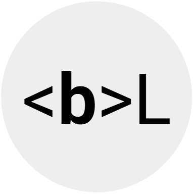
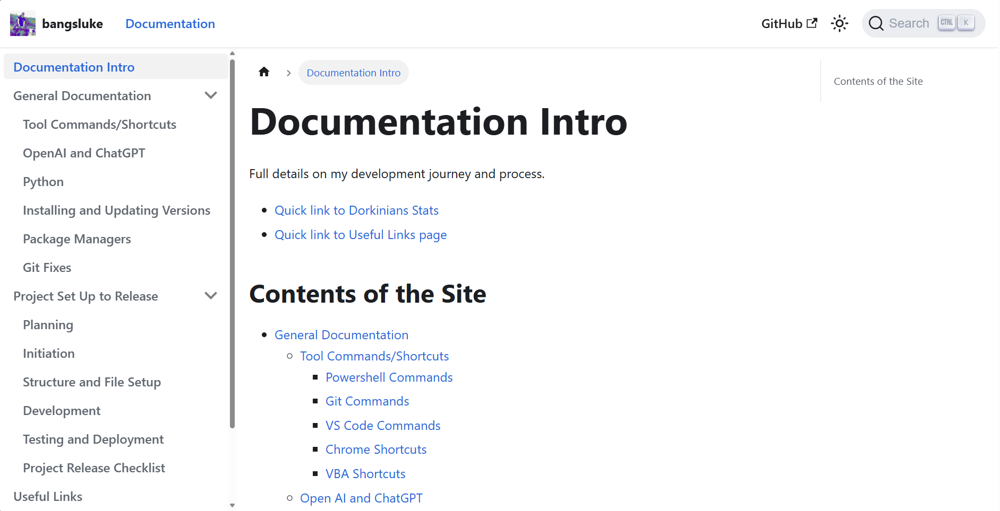

<p align="center">
  
</p>

<h1 align="center">bangsluke Documentation</h1>

<p align="center">
  Central documentation hub for development practices, delivery workflows, and project knowledge across the bangsluke ecosystem.
</p>

<p align="center">
  <a href="https://bangsluke-documentation.netlify.app/">🌐 Live Site</a> •
  <a href="https://github.com/bangsluke/bangsluke-documentation">💻 GitHub Repository</a> •
  <a href="#documentation-areas">✨ Documentation Areas</a> •
  <a href="#tech-stack">🛠️ Tech Stack</a> •
  <a href="#project-overview">🏗️ Project Overview</a> •
  <a href="https://bangsluke-documentation.netlify.app/docs/documentation-intro">📚 Documentation Intro</a>
</p>

<p align="center">
   <a href="https://app.netlify.com/projects/bangsluke-documentation/deploys" style="text-decoration: none;">
    
  </a>
  
  
  
</p>

<p align="center">
  
</p>

## Table of Contents

- [Table of Contents](#table-of-contents)
- [Project Overview](#project-overview)
- [Documentation Areas](#documentation-areas)
- [Tech Stack](#tech-stack)
- [Quick Start](#quick-start)
  - [Prerequisites](#prerequisites)
  - [Installation](#installation)
  - [Local Development](#local-development)
  - [Production Build](#production-build)
  - [Serve Build Locally](#serve-build-locally)
- [Developer Commands](#developer-commands)
- [PWA and Offline Support](#pwa-and-offline-support)
  - [Features](#features)
  - [Validating Offline Mode Locally](#validating-offline-mode-locally)
- [Contributing](#contributing)

## Project Overview

This repository powers the **bangsluke documentation site**, built with Docusaurus and published at [bangsluke-documentation.netlify.app](https://bangsluke-documentation.netlify.app/).

It captures practical guidance and reference material across product management, agile delivery, SDLC, release workflows, project write-ups, and reusable development notes.

## Documentation Areas

Primary documentation categories:

- [Product Management](https://bangsluke-documentation.netlify.app/docs/product-management/product-management-intro)
- [Agile](https://bangsluke-documentation.netlify.app/docs/agile/overview-and-mindset)
- [Software Development Life Cycle](https://bangsluke-documentation.netlify.app/docs/SDLC/introduction)
- [Project Set Up to Release](https://bangsluke-documentation.netlify.app/docs/project-set-up-to-release/planning)
- [Projects](https://bangsluke-documentation.netlify.app/docs/projects/dorkinians-website)
- [General Documentation](https://bangsluke-documentation.netlify.app/docs/general-documentation/tool-commands-and-shortcuts)
- [Useful Links](https://bangsluke-documentation.netlify.app/docs/useful-links)

The full entry page is available at [`docs/DocumentationIntro.md`](./docs/DocumentationIntro.md).

## Tech Stack

- **Docusaurus 3** (`@docusaurus/core`, `@docusaurus/preset-classic`) for documentation site generation
- **React 19** for rendering and component-level customization
- **Prism + custom themes** for syntax highlighting
- **Docusaurus PWA plugin** for installable/offline documentation
- **Image zoom plugin** and custom remark/plugin scripts for authoring workflow

## Quick Start

### Prerequisites

- Node.js `>=18.0`
- npm (or an equivalent package manager)

### Installation

```bash
npm install
```

### Local Development

```bash
npm run dev
```

Starts a local docs server at `http://127.0.0.1:3000` with live reload for content changes.

### Production Build

```bash
npm run build
```

Build output is generated into `build/`.

### Serve Build Locally

```bash
npm run serve
```

Use this to verify production behaviour (including service worker behaviour) before deployment.

## Developer Commands

- `npm run generate-docs-sidebar-meta` - Regenerates docs sidebar metadata
- `npm run docusaurus` - Runs the Docusaurus CLI directly
- `npm run clear` - Clears Docusaurus generated cache/state
- `npm run write-translations` - Extracts translation files
- `npm run write-heading-ids` - Generates stable heading IDs
- `npm run deploy` - Builds/deploys site using Docusaurus deploy workflow

## PWA and Offline Support

This site is configured as a Progressive Web App using `@docusaurus/plugin-pwa`, allowing installation and offline browsing of cached documentation pages.

### Features

- **Offline Access**: Documentation pages are available without an active connection after caching.
- **Offline Ready Indicator**: A "Ready for offline use" notification appears once caching finishes.
- **Installable Experience**: The site can be installed as an app on supported devices.

### Validating Offline Mode Locally

1. Build the project:
   ```bash
   npm run build
   ```
2. Serve the production build:
   ```bash
   npm run serve
   ```
3. Open `http://localhost:3000/?offlineMode=true` to test offline activation behaviour.

## Contributing

- Keep docs updates focused and scoped to the section being improved.
- When adding or moving docs, ensure navigation/sidebars remain coherent.
- Run local development or production build checks before opening a pull request.
- Prefer clear headings and concise sections to maintain readability across the site.
